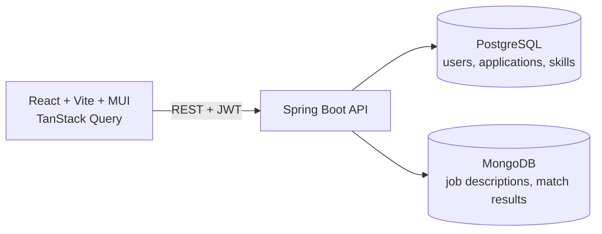

# ApplyTrack

A job-application tracker that scores each job description against your skills,
so you can see what to learn and which resume version gets responses.

## Why I built it

<!-- Write 3-4 sentences in your own words: the problem you hit while tracking your
     own applications (spreadsheet chaos? forgetting follow-ups? not knowing which
     resume works?) and what you wanted instead. This paragraph is what recruiters read first. -->

## Features

- JWT authentication; every record is scoped to the logged-in user
- Applications with paging, sorting, status filtering and inline stage changes
- Paste a job description, get a match score plus matched and missing keywords
- Dashboard: pipeline counts, response rate per resume version, most common skill gaps
- Daily scheduled job that flags applications with no movement for 7 days

## Screenshots


## Architecture



### Why two databases

- **PostgreSQL** holds users, applications and skills: relational data with foreign keys,
  unique constraints, transactions, and paged, sorted, filtered queries.
- **MongoDB** holds job-description analyses: a text blob plus variable-length keyword
  arrays, written whole per analysis. The dashboard's "top missing keywords" is a Mongo
  aggregation (`match` → `unwind` → `group` → `sort` → `limit`).
- Honest trade-off: the analyses could live in Postgres too. The split was a deliberate design
  choice to use each store for the shape of data it handles best.

## How matching works

`KeywordExtractor` scans the text for terms from `keywords.txt` using word-boundary regexes
(so `java` never matches inside `javascript`). `MatchService` compares them with your skills:
`score = matched / extracted × 100`. It is vocabulary-based, not NLP: it only finds terms
listed in `keywords.txt`.

## Run it

```bash
cp .env.example .env      # then set JWT_SECRET to a long random string
docker compose up --build
```

- App: http://localhost:3000
- API: http://localhost:8080

## Tests

```bash
cd api
./gradlew test
```

Unit tests (JUnit 5, Mockito) cover keyword extraction, match scoring, and per-user data
isolation. A MockMvc integration test covers register, login and JWT-protected access on an
in-memory H2 database, so no external services are needed.

## API overview

| Method | Path | Purpose |
|---|---|---|
| POST | `/api/auth/register`, `/api/auth/login` | Returns a JWT |
| GET/POST | `/api/applications` | Paged list (`status`, `page`, `size`, `sort`) / create |
| GET/PUT/DELETE | `/api/applications/{id}` | Read / edit / delete |
| PATCH | `/api/applications/{id}/status` | Move stage |
| GET/POST | `/api/applications/{id}/match` | Saved analysis / analyse a job description |
| GET/POST/DELETE | `/api/skills` | Manage your skills |
| GET | `/api/dashboard` | Summary stats |

A Postman collection is in [`postman/`](postman/ApplyTrack.postman_collection.json).

## Tech stack

Java 21, Spring Boot, Spring Security (JWT), Spring Data JPA, PostgreSQL, Spring Data MongoDB,
React, Vite, MUI, TanStack Query, Docker Compose, JUnit 5, Mockito, GitLab CI.